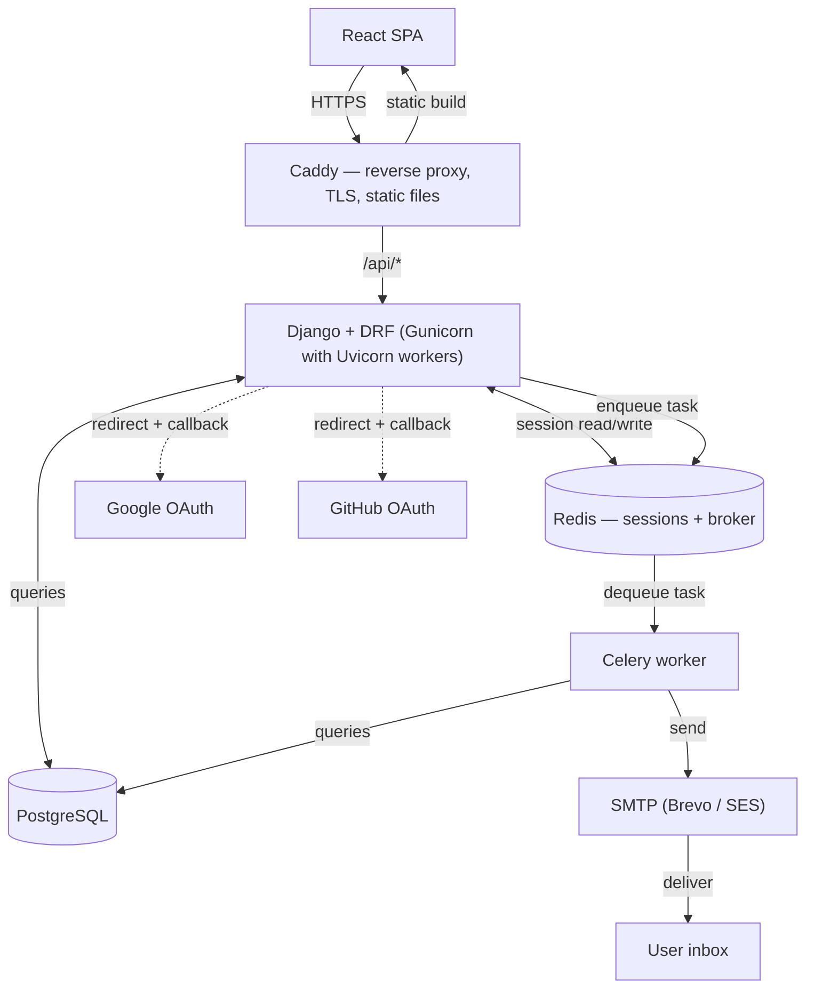

The above is a diagram that illustrates the architecture of a web application. It shows the flow of data between different components, including the browser, reverse proxy (Caddy), backend (Django with DRF), task queue (Celery), database (PostgreSQL), caching/session store (Redis), and external services for authentication (Google and GitHub) and email delivery (SMTP). The arrows indicate the direction of communication and interaction between these components. 

The following will be the folder structure of the project:
Django_Easy_Auth/
├── config/                     # project root — settings, URLs, WSGI/ASGI entry points
│   ├── __init__.py
│   ├── asgi.py
│   ├── wsgi.py
│   ├── urls.py
│   └── settings/
│       ├── __init__.py
│       ├── base.py
│       ├── dev.py
│       └── production.py
│
├── core/                       # cross-app shared code — the ONE global handler, not per-app logic
│   ├── __init__.py
│   └── exceptions.py           # global DRF exception handler: catches anything unhandled,
│                                # formats a uniform JSON error payload, logs it — infra-level,
│                                # not business-level (see each app's own exceptions.py for that)
│
├── auth/                       # unauthenticated flows: signup, login, verify, password reset
│   ├── __init__.py
│   ├── models.py
│   ├── exceptions.py           # app-specific exceptions services raise, e.g. TokenExpired
│   ├── serializers.py          # input/output shape only, no business logic
│   ├── services.py             # business logic — signup, login, reset
│   ├── tasks.py                 # celery tasks — verification/reset emails
│   ├── views.py                 # thin — routing + calling services
│   └── tests.py
│
├── accounts/                   # authenticated self-service: change password/email, profile
│   ├── __init__.py
│   ├── models.py
│   ├── exceptions.py
│   ├── serializers.py
│   ├── services.py
│   ├── tasks.py
│   ├── permissions.py          # object-level: users can only touch their own data
│   ├── views.py
│   └── tests.py
│
├── mfa/                         # TOTP setup, verify, disable, recovery codes
│   ├── __init__.py
│   ├── models.py                # recovery codes at minimum — confirm what allauth's MFA module covers
│   ├── exceptions.py
│   ├── serializers.py
│   ├── services.py
│   ├── views.py
│   └── tests.py
│
└── sessions/                    # active-session listing, revoke-one, revoke-all
    ├── __init__.py
    ├── exceptions.py
    ├── serializers.py
    ├── services.py
    ├── views.py
    └── tests.py