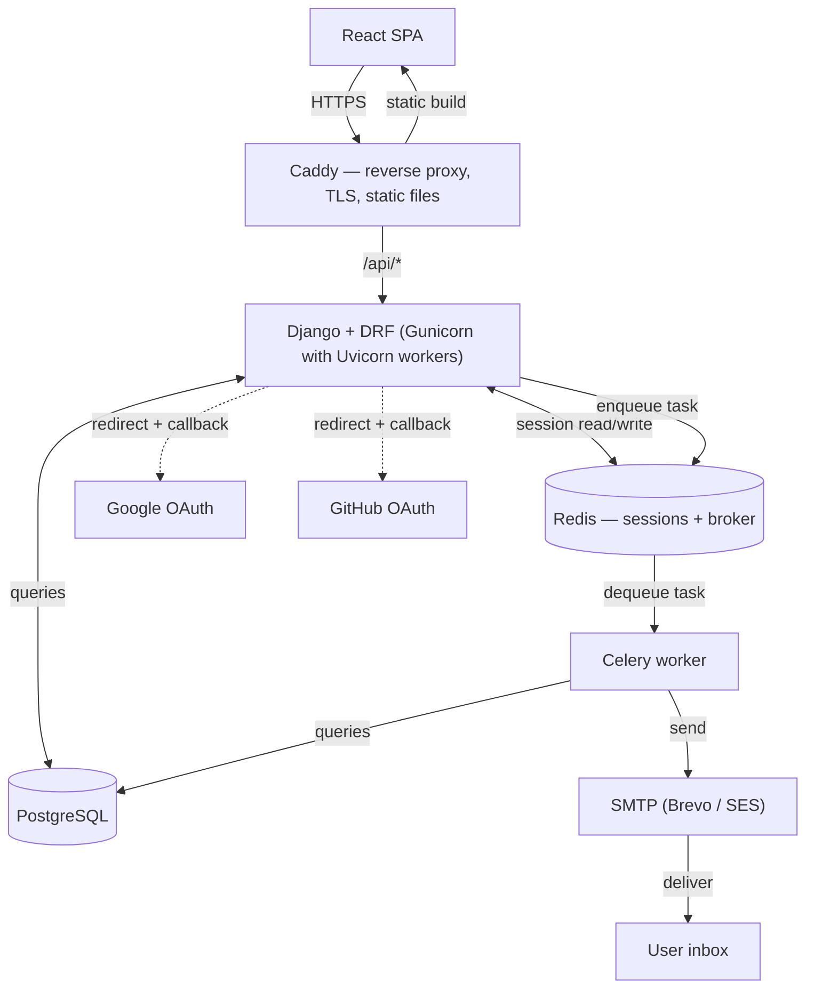

# Day 3 — Architecture

Sprint 0, Day 3. System diagram, folder structure, service-layer / serializer / permissions conventions, caching strategy, session lifecycle, and the full API route list — before any application code exists.

---

## System diagram

Browser talks only to Caddy. Caddy routes `/api/*` to Django and serves the built React app directly for everything else. Django reads/writes Redis for sessions, queries Postgres, and redirects to Google/GitHub for OAuth. Django enqueues jobs onto Redis; Celery dequeues them to send email via SMTP.
