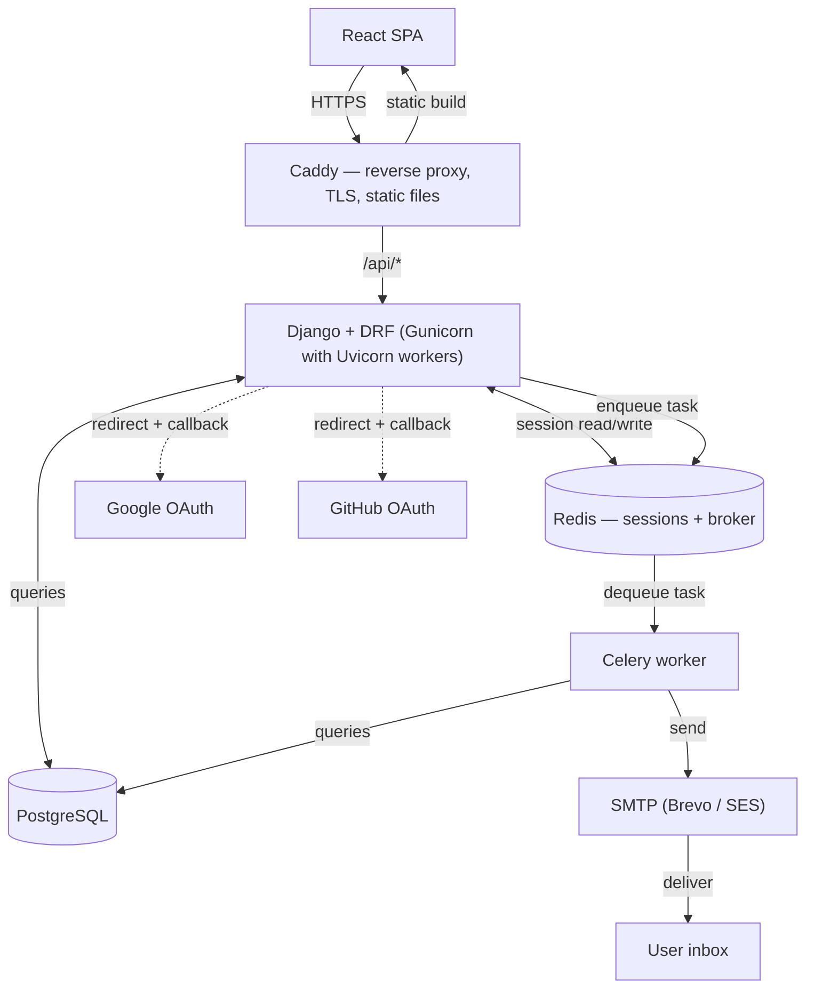

The above is a diagram that illustrates the architecture of a web application. It shows the flow of data between different components, including the browser, reverse proxy (Caddy), backend (Django with DRF), task queue (Celery), database (PostgreSQL), caching/session store (Redis), and external services for authentication (Google and GitHub) and email delivery (SMTP). The arrows indicate the direction of communication and interaction between these components. 

The following will be the folder structure of the project:
Django_Easy_Auth/
├── config/                     # project root — settings, URLs, WSGI/ASGI entry points
│   ├── __init__.py
│   ├── asgi.py
│   ├── wsgi.py
│   ├── urls.py
│   └── settings/
│       ├── __init__.py
│       ├── base.py
│       ├── dev.py
│       └── production.py
│
├── core/                       # cross-app shared code — the ONE global handler, not per-app logic
│   ├── __init__.py
│   └── exceptions.py           # global DRF exception handler: catches anything unhandled,
│                                # formats a uniform JSON error payload, logs it — infra-level,
│                                # not business-level (see each app's own exceptions.py for that)
│
├── auth/                       # unauthenticated flows: signup, login, verify, password reset
│   ├── __init__.py
│   ├── models.py
│   ├── exceptions.py           # app-specific exceptions services raise, e.g. TokenExpired
│   ├── serializers.py          # input/output shape only, no business logic
│   ├── services.py             # business logic — signup, login, reset
│   ├── tasks.py                 # celery tasks — verification/reset emails
│   ├── views.py                 # thin — routing + calling services
│   └── tests.py
│
├── accounts/                   # authenticated self-service: change password/email, profile
│   ├── __init__.py
│   ├── models.py
│   ├── exceptions.py
│   ├── serializers.py
│   ├── services.py
│   ├── tasks.py
│   ├── permissions.py          # object-level: users can only touch their own data
│   ├── views.py
│   └── tests.py
│
├── mfa/                         # TOTP setup, verify, disable, recovery codes
│   ├── __init__.py
│   ├── models.py                # recovery codes at minimum — confirm what allauth's MFA module covers
│   ├── exceptions.py
│   ├── serializers.py
│   ├── services.py
│   ├── views.py
│   └── tests.py
│
└── sessions/                    # active-session listing, revoke-one, revoke-all
    ├── __init__.py
    ├── exceptions.py
    ├── serializers.py
    ├── services.py
    ├── views.py
    └── tests.py

The service layer rule: 
- The service layer is where all business logic will live. Plain views (no business logic,
views will handle routing. And similarly, every single service layer will have a exceptions.py file per application that are plain exceptions that services will raise). It will carry over. The only time for a function, a service layer won't exist will be a specific scenario where an abstraction will create more complexity. However, due to the nature of this project, the service layer will exist for almost every view. Where it won't need, I won't write a separate service function. 

The serializer convention: 
1) Serializers won't do anything else than serialize and deserialize data. They won't have any business logic. 
2) SerializerMethodField will be avoided unless absolutely necessary. It's only for read only fields btw, not for write operations.
3) The valid data by serialziers will be passed to service layer like this: 
```python
your_service_function(**serializer.validated_data)
```
4) Serializers shall do strict input validation on the data. Things like password length, password convention, email format, etc. this is serializers' job actual one. 

5) Serializers only generate input/output level exceptions. All other exceptions will be raised by permissions.py (for permissions), services.py (for business logic), and global exception handler (for something like 500s - never leaking a full stack trace to the client).

The permissions architecture:
1) Permissions will be handled by permissions.py file in each application, unless the logic is simply a one off that wiring it to views is totally fine.
2) Permissions shall raise 404 not found for resources that don't belong to the user. This is a security measure to avoid leaking information about the existence of resources.
3) Permissions.py file will only raise permission related exceptions. Not anything other than this. 
4) Permission will be used like this: get object or raise 404 works best esp. for private data like this which other user has no business accessing. Otherwise, for data that is let's say shared but needs role based access, we use a permission class to raise 403 forbidden, an actual use case.

The level 0 permission: 
- Login, sign up, password reset without login, verifying an email, fetching the CSRF token from the @ensure_csrf_cookie decorator. This is level 0 because it doesn't require the user to be logged in. This is the only level of permission that doesn't require the user to be logged in.

The level 1 permission:
- All authenticated endpoints that require the user to be logged in. This is the most common level of permission. A users' session list, a users' profile, changing a users' password, changing a users' email, etc. All of these require the user to be logged in. This is level 1 permission.

Level 2 permission:
- Level 1 permission + object level permission. This is the most strict level of permission. This is for endpoints that require the user to be logged in and also require the user to have access to a specific resource. For example, if a user wants to change their password, they need to be logged in (level 1) and they need to have access to their own account (level 2). Same goes for changing a users' email, changing a users' profile, etc. All of these require the user to be logged in and also require the user to have access to their own account. This is level 2 permission. For any resource that a user has no business accessing, we will return a 404 not found, not 403 forbidden. This is a security measure to avoid leaking information about the existence of resources.

