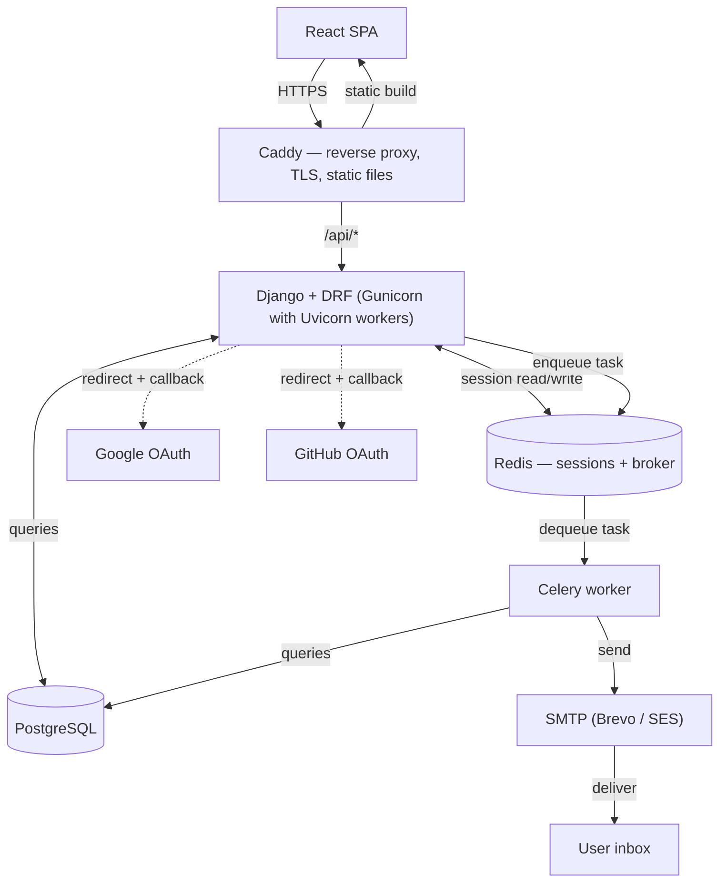

# Day 3 — Architecture

Sprint 0, Day 3. System diagram, folder structure, service-layer / serializer / permissions conventions, caching strategy, session lifecycle, and the full API route list — before any application code exists.

---

## System diagram



Browser talks only to Caddy. Caddy routes `/api/*` to Django and serves the built React app directly for everything else. Django reads/writes Redis for sessions, queries Postgres, and redirects to Google/GitHub for OAuth. Django enqueues jobs onto Redis; Celery dequeues them to send email via SMTP.

---

## Folder structure

```
Django_Easy_Auth/
├── config/                     # project root — settings, URLs, WSGI/ASGI entry points
│   ├── __init__.py
│   ├── asgi.py
│   ├── wsgi.py
│   ├── urls.py
│   └── settings/
│       ├── __init__.py
│       ├── base.py
│       ├── dev.py
│       └── production.py
│
├── core/                        # cross-app shared code — the ONE global handler, not per-app logic
│   ├── __init__.py
│   └── exceptions.py            # global DRF exception handler: catches anything unhandled,
│                                 # formats a uniform JSON error payload, logs it — infra-level,
│                                 # not business-level (see each app's own exceptions.py for that)
│
├── auth/                        # unauthenticated flows: signup, login, verify, password reset
│   ├── __init__.py
│   ├── models.py
│   ├── exceptions.py            # app-specific exceptions services raise, e.g. TokenExpired
│   ├── serializers.py           # input/output shape only, no business logic
│   ├── services.py              # business logic — signup, login, reset
│   ├── tasks.py                 # celery tasks — verification/reset emails
│   ├── views.py                 # thin — routing + calling services
│   └── tests.py
│
├── accounts/                    # authenticated self-service: change password/email, profile
│   ├── __init__.py
│   ├── models.py
│   ├── exceptions.py
│   ├── serializers.py
│   ├── services.py
│   ├── tasks.py
│   ├── permissions.py           # object-level: users can only touch their own data
│   ├── views.py
│   └── tests.py
│
├── mfa/                          # TOTP setup, verify, disable, recovery codes
│   ├── __init__.py
│   ├── models.py                 # recovery codes at minimum — confirm what allauth's MFA module covers
│   ├── exceptions.py
│   ├── serializers.py
│   ├── services.py
│   ├── views.py
│   └── tests.py
│
└── sessions/                     # active-session listing, revoke-one, revoke-all
    ├── __init__.py
    ├── exceptions.py
    ├── serializers.py
    ├── services.py
    ├── views.py
    └── tests.py
```

`sessions` is a separate app from `accounts` despite the FK dependency — session management has its own roadmap days (35, 36, 41, 49: ghost-session fix, concurrent-session policy, session-behavior tests, revoke actions) and its own service surface, not just a couple of thin fields on the user.

---

## Service layer

- All business logic lives in `services.py`. Views are thin — routing and calling services only.
- Every app has its own `exceptions.py` for plain, app-specific exceptions that services raise (e.g. `TokenExpired`). This is separate from `core/exceptions.py`, which holds the one global DRF exception handler — it intercepts anything unhandled project-wide, formats a uniform JSON error payload, and logs it. Infra-level, not business-level.
- A service function is skipped only when the abstraction would add more complexity than it removes. Given this project's nature, that's the exception, not the default — service layer exists for almost every view.

## Serializer conventions

1. Serializers only serialize/deserialize. No business logic.
2. `SerializerMethodField` is avoided unless necessary, and only for read-only fields — never for write operations.
3. Validated data is passed to the service layer as keyword arguments:
   ```python
   your_service_function(**serializer.validated_data)
   ```
4. Serializers do strict input validation — password length/complexity, email format, and similar shape-level checks. This is genuinely their job.
5. Serializers only raise input/output-level exceptions. Everything else is raised elsewhere: `permissions.py` for permission exceptions, `services.py` for business-logic exceptions, the global exception handler for 500s (never leaking a full stack trace to the client).

## Permissions architecture

1. Permissions live in each app's `permissions.py`, unless the logic is a genuine one-off simple enough to wire directly onto the view.
2. Permissions raise 404, not 403, for resources that don't belong to the requesting user — this avoids leaking whether the resource exists at all.
3. `permissions.py` only raises permission-related exceptions — nothing else.
4. Mechanism depends on the case: `get_object_or_404` scoped to the requesting user is the default for private, per-user data (handles level-2 object ownership automatically, collapsing "doesn't exist" and "not yours" into the same 404). A permission class raising 403 is used instead for genuinely shared/role-based access cases.

**Level 0** — no auth required: login, signup, password reset (unauthenticated), email verification, CSRF cookie fetch.

**Level 1** — authenticated: session list, profile, password change, email change — anything that just requires being logged in.

**Level 2** — level 1 + object ownership: same actions as above, scoped to the specific resource being *this* user's. Anything the user has no business accessing returns 404, never 403.

## Caching strategy

**`/api/auth/me`**
- Client side: React Query, 5-minute TTL. The cache is actively busted on every mutating action below, so it's never meaningfully stale in normal use — the TTL exists purely as a fallback/data-sync safety net, not as the primary invalidation mechanism.
- Server side: Redis, ~7-day TTL, cache warmup via cron during off-peak hours. Justified by an overwhelmingly high read/write ratio — this endpoint gets hit on every protected route.
- Invalidation events (both client and server cache, unless noted): email change, password change, profile change (full name, etc.), nuclear logout (all devices), MFA enabled/disabled, login-method changes (linking/unlinking social accounts). A single-device logout does **not** invalidate this cache — other devices' sessions remain valid and `/me` for them is still correct.

**Session list**
- Client side: React Query, invalidated on logout, nuclear logout, or a specific device logout.
- Server side: Redis, scoped per user, high TTL justified by a high read/write ratio (users rarely log in/out relative to how often the list might be viewed). Write-through cache; invalidated on any session-purge event (not just explicit logout — this includes the Day 35 ghost-session purge). On cache failure, serve accurate data straight from the DB, stop relying on the cache, and log the failure to Sentry.

Client-side and server-side invalidation are independent — a fresh backend invalidation does not guarantee an open browser tab's client cache reflects it instantly; the 5-minute client fallback window covers that gap by design, not by bug.

## Session lifecycle

1. Without "remember me," the session ends as soon as the browser closes.
2. With "remember me," session TTL is 7 days with sliding expiration — activity extends it, tracked via `last_active_at`. 7 days of inactivity expires the session.
3. On password change:
   - Changed while **logged out** (via reset flow): purge all sessions, all devices.
   - Changed while **logged in**: purge all sessions except the current one, so the user isn't logged out of the session they're actively using. Same rule applies to email changes. Non-sensitive field changes (e.g. full name) don't purge anything.

Device identification for the session list is derived from the User-Agent header at session-creation time (browser/OS/device type) — not a persisted device fingerprint. Location (city/country) is deliberately deferred for v1; device + IP address is sufficient to distinguish sessions.

