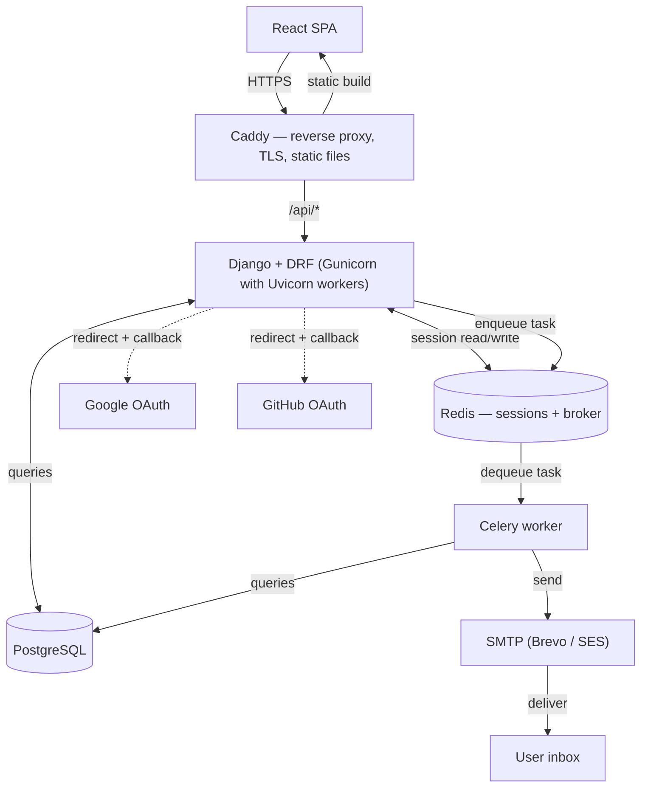

# Day 3 — Architecture

Sprint 0, Day 3. System diagram, folder structure, service-layer / serializer / permissions conventions, caching strategy, session lifecycle, and the full API route list — before any application code exists.

---

## System diagram



Browser talks only to Caddy. Caddy routes `/api/*` to Django and serves the built React app directly for everything else. Django reads/writes Redis for sessions, queries Postgres, and redirects to Google/GitHub for OAuth. Django enqueues jobs onto Redis; Celery dequeues them to send email via SMTP.

---

## Folder structure

```
Django_Easy_Auth/
├── config/                     # project root — settings, URLs, WSGI/ASGI entry points
│   ├── __init__.py
│   ├── asgi.py
│   ├── wsgi.py
│   ├── urls.py
│   └── settings/
│       ├── __init__.py
│       ├── base.py
│       ├── dev.py
│       └── production.py
│
├── core/                        # cross-app shared code — the ONE global handler, not per-app logic
│   ├── __init__.py
│   └── exceptions.py            # global DRF exception handler: catches anything unhandled,
│                                 # formats a uniform JSON error payload, logs it — infra-level,
│                                 # not business-level (see each app's own exceptions.py for that)
│
├── auth/                        # unauthenticated flows: signup, login, verify, password reset
│   ├── __init__.py
│   ├── models.py
│   ├── exceptions.py            # app-specific exceptions services raise, e.g. TokenExpired
│   ├── serializers.py           # input/output shape only, no business logic
│   ├── services.py              # business logic — signup, login, reset
│   ├── tasks.py                 # celery tasks — verification/reset emails
│   ├── views.py                 # thin — routing + calling services
│   └── tests.py
│
├── accounts/                    # authenticated self-service: change password/email, profile
│   ├── __init__.py
│   ├── models.py
│   ├── exceptions.py
│   ├── serializers.py
│   ├── services.py
│   ├── tasks.py
│   ├── permissions.py           # object-level: users can only touch their own data
│   ├── views.py
│   └── tests.py
│
├── mfa/                          # TOTP setup, verify, disable, recovery codes
│   ├── __init__.py
│   ├── models.py                 # recovery codes at minimum — confirm what allauth's MFA module covers
│   ├── exceptions.py
│   ├── serializers.py
│   ├── services.py
│   ├── views.py
│   └── tests.py
│
└── sessions/                     # active-session listing, revoke-one, revoke-all
    ├── __init__.py
    ├── exceptions.py
    ├── serializers.py
    ├── services.py
    ├── views.py
    └── tests.py
```

`sessions` is a separate app from `accounts` despite the FK dependency — session management has its own roadmap days (35, 36, 41, 49: ghost-session fix, concurrent-session policy, session-behavior tests, revoke actions) and its own service surface, not just a couple of thin fields on the user.

---

## Service layer

- All business logic lives in `services.py`. Views are thin — routing and calling services only.
- Every app has its own `exceptions.py` for plain, app-specific exceptions that services raise (e.g. `TokenExpired`). This is separate from `core/exceptions.py`, which holds the one global DRF exception handler — it intercepts anything unhandled project-wide, formats a uniform JSON error payload, and logs it. Infra-level, not business-level.
- A service function is skipped only when the abstraction would add more complexity than it removes. Given this project's nature, that's the exception, not the default — service layer exists for almost every view.

