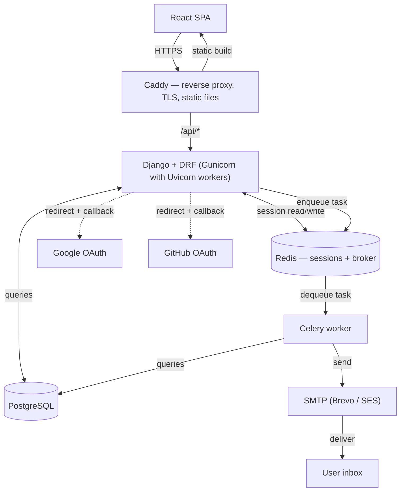

The above is a diagram that illustrates the architecture of a web application. It shows the flow of data between different components, including the browser, reverse proxy (Caddy), backend (Django with DRF), task queue (Celery), database (PostgreSQL), caching/session store (Redis), and external services for authentication (Google and GitHub) and email delivery (SMTP). The arrows indicate the direction of communication and interaction between these components. 